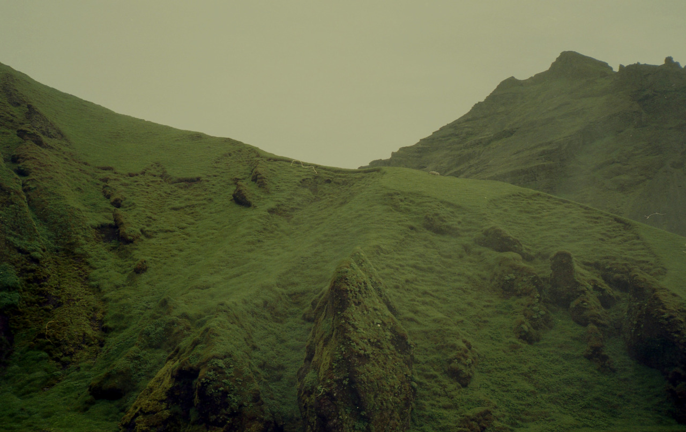

# pyPrettyBackground
Do you need some variation in your desktop background? After my Windows machine stated showing me ads instead of the photos
capturing the beauty contained in nature across the world, I turned it off. I missed seeing something new and beautiful 
every day, and I wanted to restore that feature!

This simple program utilizes machine learning with a convolutional neural network (CNN) for feature extraction to recommend
you similar landscape, desktop-background-esque, images to those you upload.

## Dataset
I used the Landscapes HQ dataset (https://github.com/universome/alis/blob/master/lhq.md), originally compiled for use in
the paper Aligning Latent and Image Spaces to Connect the Unconnectable (Skorokhodov, Sotnikov
, Elhoseiny, 2021) (https://arxiv.org/pdf/2104.06954).

This dataset contains 90000 high quality landscape photographs, all equally beautiful and suited for your desktop background!

## Tools
To preprocess the data, I used **PIL** and **PyTorch** to transform the images into 224x224 images, the input size dictated
by the ResNet50 model.

I used **PyTorch's** pretrained ResNet50 model to identify the feature vectors of images uploaded by the user, and in the dataset.
I modified the model by removing the final classification layer to instead extract the feature vector for image comparison.
The ResNet50 neural network was originally trained on the ImageNet database, and it's performance here is a great example of
transfer learning.

I used **Pandas** to organize the feature vectors of the images contained in the dataset as **.csv** files, to avoid 
recomputation when finding a similar image. This .csv file is only required to be built once. In future uses, it is 
converted to a Pandas Dataframe.

To recommend the best image to the user based on it's extracted features, I used **cosine similarity**, a simple machine 
learning technique used to evaluate the closeness between two images using their feature vector.

To interact with the CNN I created a basic **CLI**, allowing users to specify which image they'd like to find a similar 
image to without having to modify any code.

## How to Use
First you will have to extract the features of the dataset images:

Start by downloading the LHQ dataset from https://github.com/universome/alis/blob/master/lhq.md.

After the dataset is downloaded, modify the dataset_path to the LHQ dataset folder in *init_dataset_feature_vectors.py*, 
along with the *feature_vectors_path* to match where the repo is located.

Then, by issuing the first command you can initialize the .csv file containing the feature vectors of the 90000 dataset
images. This will take some time.

The output of command to find a similar image is the path to the file from the dataset containing the similar image.

I extracted the features of each of the 90000 images using the 256 x 256 lhq dataset, however the program is organized
in a way that if you'd like to have the images in higher quality (for example, 1024x1024, also available from the LHQ dataset),
the image recommendation system will recommend you the corresponding image in whatever quality is available specified
by the path to the LHQ dataset described above.

I am curious as to how the produced feature vectors might have changed if I were to have extracted them from the version
of the dataset with higher resolution.

## Example
**Input:**

**Output:**

